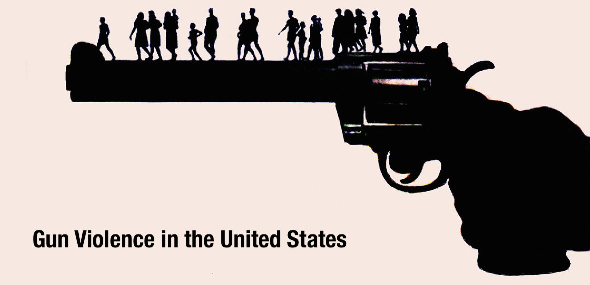
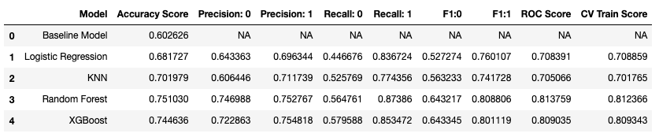
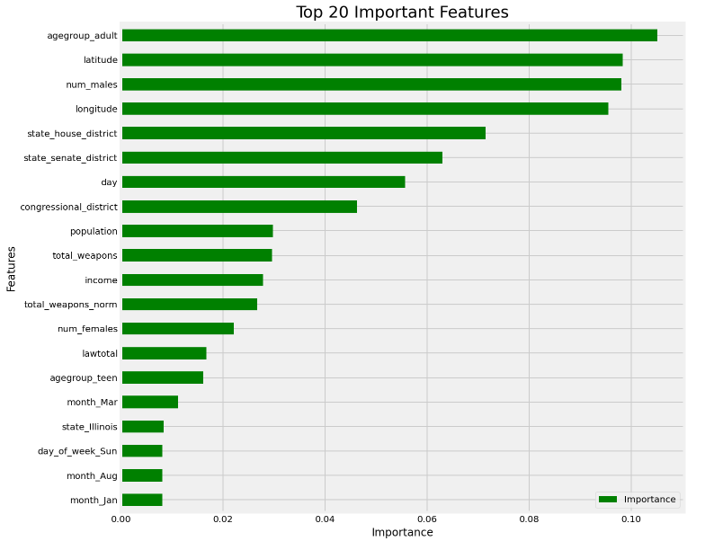

#  Capstone Project: Gun Violence in the United States

## Problem Statement

Gun violence is a reality of life for many in the United States. According to data from the [Pew Research Center](https://www.pewresearch.org/fact-tank/2019/10/22/facts-about-guns-in-united-states/), U.S. gun deaths have increased in recent years and 44% of Americans say that they know someone who has been shot. The debate over gun violence protection has been an ongoing one over the years and with 100 people in America dying of gun violence each day, the equivalent of multiple mass shootings, seven days a week, it is viewed as a [public health crisis and an epidemic](https://www.usatoday.com/story/opinion/2019/09/10/gun-violence-public-health-crisis-requires-action-doctor-column/2268282001/).

As such, this project aims to examine gun violence trends in the United States and identify the key factors in driving gun violence casualties.

Due to the length of the project, I've split the Jupyter notebooks into 4 parts:
1. Data Cleaning & EDA (I)
2. Data Cleaning & EDA (II)
3. Modeling Classification (I)
4. Modeling Classification (II)

---

## Datasets

- [Gun Violence Archive](https://www.gunviolencearchive.org/): Gun violence incidents from January 2014 to March 2018. This dataset was downloaded from [Kaggle](https://www.kaggle.com/jameslko/gun-violence-data) but it was originally scraped from the Gun Violence Archive. *Note: this dataset is too large to be uploaded to Github so it's missing in the data folder.*
- [US Census Bureau](https://www.census.gov/): US State popluation from 2010-2019.
- [Gun Control Provisions](https://www.kaggle.com/jboysen/state-firearms): Data covers gun provisions in all 50 US states from 1991-2017. 0/1 (absence/presence) is encoded on 133 provisions across 50 states, by state and by year. For simplicity, I used `lawtotal` i.e. total number of provisions by state and by year for this project.
- [270 to Win](https://www.270towin.com/states/): Election results from 2000 to 2016 for each state. This dataset lists the percentage of votes the democrats and republicans received in each state. 
- [Bureau of Economic Analysis](https://apps.bea.gov/iTable/index_regional.cfm): Personal income data for each state from 2009-2017.
- [Bureau of Alcohol, Tobacco, Firearms and Explosives](https://www.atf.gov/resource-center/data-statistics): Annual weapons registration data for each state from 2011-2017.

### Data Dictionary

|Feature|Type|Dataset|Description|
|---|---|---|---|
|incident_id|int64|combined|ID of incident reported| 
|date|object|combined|Date of incident| 
|state|object|combined|US State| 
|city_or_county|object|combined|US City or County| 
|n_killed|int64|combined|Number of people killed|
|n_injured|int64|combined|Number of people injured|
|congressional_district|float64|combined|Congression district|
|latitude|float64|combined|Latitude coordinates|
|longitude|float64|combined|Longitude coordinates|
|state_house_district|float64|combined|State house district|
|state_senate_district|float64|combined|State senate district|
|year|int64|combined|Year of incident|
|month|object|combined|Month of incident|
|day|int64|combined|Date of incident (1-31)|
|day_of_week|object|combined|Day of incident e.g. Mon|
|agegroup_child|int64|combined|Number of children (0-11) involved| 
|agegroup_teen|int64|combined|Number of teens (12-17) involved| 
|agegroup_adult|int64|combined|Number of adults (18+) involved|
|num_males|int64|combined|Number of males involved|
|num_females|int64|combined|Number of females involved|
|population|int64|combined|State population of that year|
|lawtotal|float64|combined|Total number of provisions by state of that year|
|democrat|float64|combined|Percentage of votes the democrats received for the state|
|republican|float64|combined|Percentage of votes the republicans received for the state|
|political|object|combined|Based on the higher percentage of votes (democrat or republican)|
|income|int64|combined|Personal income by state and by year|
|total_weapons|int64|combined|Total weapons registered|
|total_weapons_norm|float64|combined|Total weapons/Population of state|
|n_casualties|int64|combined|Total number of casualties per incident (n_killed + n_injured)|
|casualties|int64|combined|Presence/absence (1/0) of casualty in an incident|

---

## Metrics

**Baseline Accuracy:**

The baseline model would predict class 1 (presence of casualty) for all incidents and it's accuracy score is 0.6.

Confusion Matrix:

True Positives (TP) We correctly predict that an incident has a casualty.

True Negatives (TN): We correctly predict that an incident doesnt not have a casualty.

False Positives (FP): We predict that an incident has a casualty but actually doesn't have a casualty.

False Negatives (FN): We predict that an incident does have have a casualty but there was actually a casualty.

As we are seeking to identify casualties in gun violence incidents reported, our priority is to get as many True Positives and as little False Negatives as possible i.e. we're aiming for high sensitivity/recall.

---

## Pre-processing & Modelling

Pre-processing Steps:
- Hot encode target column `casualities` (1 for presence of a casualty, 0 for absence of casualty)
- Dummy encode categorial columns (e.g. `month`, `year`, `day_of_week`, `state`, `political`)
- Create new features from additional datasets for specific state information (e.g. `total_weapons`, `lawtotal`, `population`, `income` etc)

For the purposes of this project, I'll be exploring 4 classification methods to derive the best model:
- Logistic Regression Classifer
- K-Nearest Neighbours Classifier
- Random Forest Classifier
- XGBoost Classifier

**GridSearchCV** will be used to perform hyperparameter tuning in order to determine the optimal values for a given model.

---

### Best Model

All 4 models did better than than the baseline model where baseline accuracy is 0.6 and baseline AUC is 0.5. Comparing the models, Random Forest performed the best with the highest accuracy score and ROC score. Recall is also slight higher than XGBoost.

---

### Top Features

---

## Conclusion & Recommendations

**Conclusions:**
- I have successfully trained a random forest classification model which has allowed us to predict casualties in gun violence incidents. The model has a 75% accuracy score on unseen test data which is higher than the baseline score of 60%. AUC score is at 81.7%.
- From the model, we're able to identify the key contributing factors:
    - Location: as latitude, longitude and districts
    - State: population, income and laws
    - Participants: age and gender
    - Timing: the day and month matters (e.g. specific holidays and weekends)
    - Weapons: total number of registered weapons 

- Locations and neighbourhoods seem like a strong factor in predicting casualties. This is in lin on Andrew Papachristos's [research](https://www.sciencedirect.com/science/article/abs/pii/S0277953614000987) where he mentions that there is a clustering of victims and geographical neighbourhood information. The risk of gunshot victimization is more concentrated in small and identifiable networks of individuals engaging in risky behavior e.g. criminal activity.

**Recommendations:**
- More targeted location information could improve the accuracy score of the model and help law enforcement groups to intervene in targeted networks where there are clusters of high-risk networks
- Increased police surveilence during holidays and weekends when there's a higher likelihood of gun violence casualties
- Explore more features like crime rate, substance abuse (alcohol/drugs), specific gun laws, gun types/prices
- Looking at state wide data like income may not be as accurate as looking into individual info with regards to the victims and suspects
- However, we also need to be mindful of the bias in data when it comes to the segregation of gender, race, income levels
