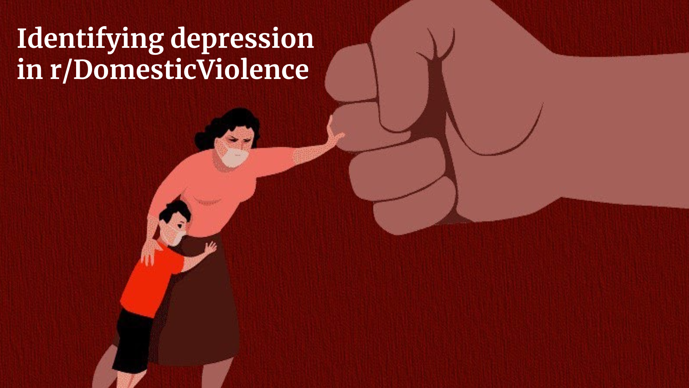
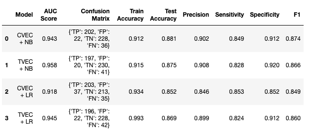

#  Project 3: Web APIs & Classification

## Problem Statement

With the [rise in domestic violence cases in recent months](https://www.nytimes.com/2020/04/06/world/coronavirus-domestic-violence.html), more people are turning to online forums like Reddit for support. 
Research have shown that [domestic abuse victims are more likely to suffer mental illness](https://www.theguardian.com/society/2019/jun/07/domestic-abuse-victims-more-likely-to-suffer-mental-illness-study) and our aim is to identify depressive language in domestic violence posts.

Due to the length of the project, I've split the Jupyter notebooks into three:

1. Data Collection
2. Data Cleaning & Exploratory Data Analysis 
3. Pre-Processing & Modelling

---
## Executive Summary

#### Data Collection 

For this project, we'll be using Reddit's API to collect posts from the following subreddits:
- [r/domesticviolence](https://www.reddit.com/r/domesticviolence/)
- [r/depression](https://www.reddit.com/r/depression/)

To access Reddit's API, we modified our request so as to not use the default user agent and used the `time.sleep()` function to allow for a break in between requests.

We managed to scrape 998 unique posts for r/domesticviolence and 955 unique posts for r/depression.

*Note: Data for this project was requested on 20 June 2020. Re-running this code on a later date would result in a new set of posts being scraped.*

---
### Data Cleaning & EDA

**Key Findings**

**1. A safe space:**
- Because users are sharing their personal experiences, the posts are genuine and of substantial length. There's also a decent amount of engagement in both subreddits which shows that people treat these groups as a safe space.
- The high scores also indicate that there are low troll rates which is likely because of the strict guidelines set by moderators to prevent spam and solicitation.
- Outlier posts with a high number of comments and/or score are genuine as well which means that the text is still useful for modelling purposes. The only posts that we will have to remove later are the 3 moderator posts that are about rules and additional information.
- Unlike many other subreddits which are filled with memes and spam, we find that the posts from r/domesticviolence and r/depression are text heavy and useful for NPL.

**2. Different yet similar:**
- Even though the subreddits are of different issues, the top 2 phrases ("feel like" and "don't know") are the same. While there are some differences in the words used, the similarities indicates that there might be depressive instances in the domestic violence subreddit which is what we're exploring in this project.

**3. It's one or the other:**
- Based on the data we collected, there were no authors who posted in both subreddits. This shows that domestic abuse victims aren't seeking help in the depression groups and hence, further confirms our case for proactively looking out for depressed individuals in the domestic violence group.

---
### Metrics

**Baseline Accuracy:**

The baseline model would predict class 0 (r/domesticviolence) for all posts and it's accuracy score is 0.511.

**Confusion Matrix:**

True Positives (TP) We correctly predict that an entry is from the r/depression subreddit.

True Negatives (TN): We correctly predict that an entry is from the r/domesticviolence subreddit.

False Positives (FP): We predict that an entry is from the r/depression subreddit but it's actually from the r/domesticviolence subreddit.

False Negatives (FN): We predict that an entry is from the r/domesticviolence subreddit but it's actually from the r/depression subreddit.

As we are seeking to identify depressive language in domestic violence cases, our priority is to get as many True Positives and as little False Negatives as possible i.e. we're aiming for high sensitivity (% of all r/depression posts that we get correct).

---
### Pre-processing & Modelling

Pre-processing Steps:
- Hot encode `subreddit` column (`1` for r/depression, `0` for r/domesticviolence)
- Remove moderator posts
- Remove punctuations
- Tokenize and lemmatize words
- Remove stopwords

We have selected 2 models for NLP:
1. Naive Bayes Classifier
- It is a classification technique based on Bayes' Theorem with an assumption of independence among predictors and is suitable for text classification.

2. Logistic Regression
- As a comparison to MultinomialNB, we have chosen logistic regression as it's a linear model for classification and we could potentially explore the effects of key words in either subreddit.

We will be using Pipeline with the chosen models and CountVectorizer/TfidfVectorizer. We will also be using RandomizedSearchCV to identify the best predictor.

---
### Best Model

All 4 models did better than than the baseline model where baseline accuracy is 0.51 and baseline AUC is 0.5.

Overall, the NB models have higher precision and test accuracy. Between CVEC + NB and TVEC + NB, the scores are pretty similar. Since we're prioritizing sensitivity (as mentioned above), and the difference between train accuracy and test accuracy is smaller, we chose CVEC + NB as the final model.

---
## Summary & Recommendations

Conclusions:
- We have trained and created a successful NLP classification model which has allowed us to differentiate a post from r/depression and r/domesticviolence.

Project limitations:
- Due to time constraints, we weren't able to explore other models (e.g. K-Nearest Neighbours, Random Forests) and features (number of comments, comment replies etc). We also weren't able to test the model on more unseen data.

Potential next steps:
- Further enhance our model by looking for more depressive language text and check success of identifying depression in other support groups like [r/cancer](https://www.reddit.com/r/cancer/), [r/anxiety](https://www.reddit.com/r/Anxiety/) or other platforms like Facebook groups where users share their experiences. 
- It will also be interesting to explore blog posts or tweets although we will have to further explore if the length of posts have an effect on the model.
